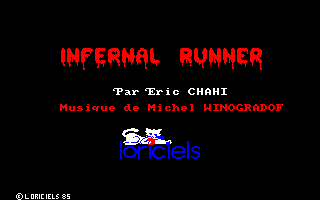

# Infernal Runner JS

This is a Javascript (HTML5) port of the Amstrad CPC game [Infernal Runner](https://www.mobygames.com/game/infernal-runner) developed by Eric Chahi.

I got curious about the game internals after reading on [Eric website](http://anotherworld.fr/anotherworld_uk/another_world.htm) the game is "coupled to a scripted mini-language".

The information presented here is based on the reverse engineering of the .dsk image and z80 code.


## Internals

The original game executable interprets bytecode with cooperative threading. There could be up to 256 threads.
Instructions are executed for each thread until it suspends. The execution will then continue with the next thread.

There are 28 opcodes in total, which can be categorized in 5 groups :

* objects (drawing)
* player (position, frame, collision)
* tilemap
* variables (add, sub, mov)
* control flow (break, jump)

Implementation of these opcodes can be found [here](https://github.com/cyxx/infernal_js/blob/master/infernal.js#L169).

As an example, the title screen is not a full screen image but has a dedicated thread to draw its contents (eg. 6 sprites).



The bytecode execution flow is :

```
bytecode #130 offset 0x515d
  0000 J (4a)  JMP_BYTECODE( num:131 )
                 bytecode #131 offset 0x5160
  0002 Z (5a)
bytecode #131 offset 0x5160
  0000 T (54)  DRAW_OBJECT_H num:211 x:15 y:48 count:1  # 'Infernal'
                 gfx #211 offset 0x75F0 w 25 h 22
  0005 T (54)  DRAW_OBJECT_H num:212 x:45 y:48 count:1  # 'Runner'
                 gfx #212 offset 0x7816 w 21 h 22
  000a T (54)  DRAW_OBJECT_H num:210 x:30 y:128 count:1 # 'Loriciels'
                 gfx #210 offset 0x7384 w 20 h 31
  000f T (54)  DRAW_OBJECT_H num:213 x:28 y:88 count:1  # 'Par Eric Chahi'
                 gfx #213 offset 0x79E4 w 29 h 7
  0014 T (54)  DRAW_OBJECT_H num:214 x:14 y:104 count:1 # 'Musique de ...'
                 gfx #214 offset 0x7AAF w 57 h 7
  0019 T (54)  DRAW_OBJECT_H num:215 x:4 y:193 count:1  # '(c) ... 85'
                 gfx #215 offset 0x7C3E w 14 h 7
  001e J (4a)  JMP_BYTECODE( num:0 )
                 bytecode #0 offset 0x0000
  0020 Z (5a)
```

In game, each object will typically have its own thread. Thread #0 corresponds to the player.

Not all of the game is scripted, things like the bottom panel and player interaction with the decor are handled in native code.


It is interesting to note Another World re-used the idea and went further by having the entirety of the game defined by bytecode.


## Port

The Javascript code loads the original .dsk image (a memory snapshot) to re-use the bytecode and original graphics (CPC mode 1).

There is no z80 emulation, the engine code has been rewritten in Javascript.

There were a few interesting tricks used in the original code :

* use of [BCD](https://github.com/cyxx/infernal_js/blob/master/inferrun.asm#L986) to manipulate decimal numbers (avoiding divides and multiplies)
* use of [XOR](https://github.com/cyxx/infernal_js/blob/master/inferrun.asm#L55) to redraw sprites (avoiding double buffering)


## Status

The game can be played at [cyxx.github.io/infernal_js](http://cyxx.github.io/infernal_js)

This repository contains a javascript interpreter, a bytecode disassembler and a z80 disassembly.
